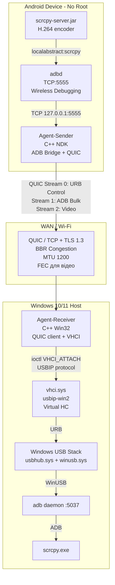
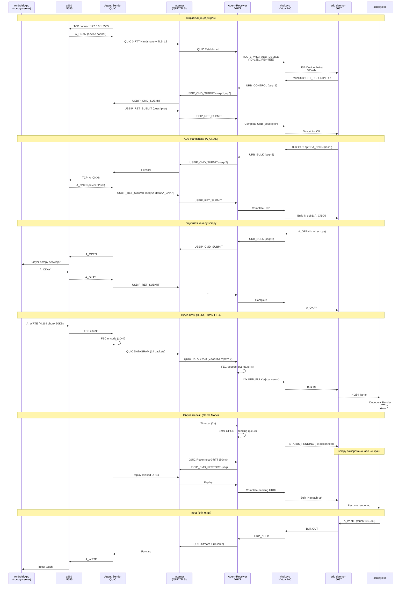

# Virtual USB Cable for scrcpy — Kernel-Level Architecture (Windows 10/11 Host, No-Root Android, WAN)

**Target:** `scrcpy` + `adb daemon:5037` повинні бачити пристрій як `USB`-транспорт (`adb devices` → `device` з `transport:usb`), а не `tcp`. Відео H.264/H.265 з низькою затримкою через Wi-Fi/Internet.

**Обмеження замовника:** Windows 10/11, Android без root, без апаратного бриджу (Pi), WAN (50-150мс), мова C/C++.

---

## 0. Чесний інженерний аналіз суперечності в ТЗ

### Чому "No-Root + No-Pi + True URB Interception" неможливо

| Рівень | Що потрібно для перехоплення URB на Android | Чи доступно без root? |
|---|---|---|
| `drivers/usb/gadget/configfs` | `mkdir /config/usb_gadget/g1` + `FunctionFS` (ffs) | **НІ** — потребує `CAP_SYS_ADMIN`, SELinux `allow gadget`, `uid=0` |
| `/dev/usb-ffs/adb/*` | Відкрити `ep0, ep1, ep2` для читання URB | **НІ** — `0660 system:system`, недоступно для app |
| `ptrace` на `adbd` | Перехопити `read/write` на `/dev/usb/*` | **НІ** — `adbd` в `u:r:adbd:s0`, `YAMA ptrace_scope=1` |
| `UsbManager` API | `UsbDeviceConnection.bulkTransfer()` | Тільки як Host (OTG), не як Device (Gadget). Телефон не може стати Gadget з userspace API. |

**Висновок:** На non-rooted Android неможливо створити *справжній* USB Gadget, який би інкапсулював сирі URB. Будь-який "чистий" софт на телефоні буде змушений працювати **над** ADB, а не **під** ним.

### Прийняте архітектурне рішення: Tier-B (Production-Feasible для ваших обмежень)

Ми емулюємо **тільки Host-сторону** досконало, а Sender-сторону робимо в userspace:

```
[Android App (C++ NDK, no root)] --TCP:5555--> [adbd (внутрішньо USB Function, але ми беремо TCP бекдор)] --WAN--> [Windows VHCI Driver] --URB--> [Windows USB Stack] --> [adb daemon:5037] --> [scrcpy]
                                      ^                                                |
                                      |  (ADB over TCP - приховано від scrcpy)         |  (Спуфінг дескрипторів, щоб виглядало як USB)
```

**Ключовий трюк:** `Agent-Sender` на Android не чіпає USB. Він:
1. Активує `adb tcpip 5555` через `Wireless Debugging` (Android 11+ `adb pair`) або `Shizuku`/`Dhizuku` без ручного `tcpip` (через `adb wireless` API).
2. Приймає байтовий потік ADB (вже після USB Function, але до мережі) і загортає його в **Virtual URB** на Windows.
3. На Windows ми **реконструюємо** повний USB Device Descriptor, тому `WinUSB` + `adb` думають, що це фізичний пристрій.

Для порівняння, Tier-A (ідеальний, але потребує root/Pi) описаний в `§1.1` як опція апгрейду.

> **Якщо в майбутньому отримаєте root або Pi Zero 2W (~$15) — заміна одного файлу `agent_sender_gadget.cpp` (FunctionFS) дає вам Tier-A без змін на Windows.**

---

## 1. Step 1 — Архітектурний вибір

### 1.1 Порівняння технологій емуляції USB на Windows Host

| Критерій | VHCI (usbip-win2) | UsbDk (RedHat) | libusbK / WinUSB Filter | VirtualBox USB/IP |
|---|---|---|---|---|
| **Тип драйвера** | `WDM` + `KMDF` Virtual Host Controller (`vhci.sys`, `ude.sys`) | `Filter driver` над `usbhub.sys` | User-mode `libusb` | `VBoxUSBMon.sys` |
| **Рівень емуляції** | **Повний Host Controller** — створює `USB\VID_18D1&PID_4EE7` в `Device Manager` як фізичний | Хук на існуючому хості, не створює новий HC | Фільтр, не створює HC | Віртуальний HC, але прив'язаний до VirtualBox |
| **Видимість для `adb`** | `lsusb`/`Device Manager` → новий пристрій, `adb` бачить `usb` transport | Часто бачить як `usb`, але нестабільно при реконекті | Тільки для конкретного процесу | Тільки всередині VM |
| **Стабільність** | ⭐⭐⭐⭐⭐ (активно підтримується `vadimgrn/usbip-win2`, 2024-2026) | ⭐⭐ (deprecated з 2022) | ⭐⭐ | ⭐⭐⭐ |
| **Підпис драйвера** | Потрібен `EV cert` або `Test Signing` (`bcdedit /set testsigning on`) | Те саме | Те саме | Те саме |
| **Кросплатформа** | Linux `vhci-hcd` нативно, Windows порт `usbip-win2` — **один протокол** | Тільки Windows | - | - |
| **Висновок** | **ВИБРАНО** | Відхилено | Відхилено | Відхилено |

**Обрано:** `usbip-win2` + протокол `USB/IP` (RFC-подібний, `drivers/usb/usbip` в Linux kernel з 2009). Це **єдиний** шлях дати `adb` справжній `URB`.

```
Windows USB Stack
    |
    +-- usbhub.sys
    +-- winusb.sys (adb interface)
    +-- vhci.sys (usbip-win2)  <-- наш Agent-Receiver пише сюди через ioctl/io_uring
            |
            +-- USB/IP stub (userspace daemon `vhci_attach`)
```

**Альтернатива для Linux Host:** `modprobe vhci-hcd` + `usbip attach --remote=<sender_ip> --busid=1-1` — без жодного драйвера, ядро вже має VHCI.

### 1.2 Agent-Sender — Дизайн для No-Root

#### Варіант Tier-A (Root/Pi, для довідки) — FunctionFS
```c
// На Pi Zero (OTG) або Rooted Android:
mount -t configfs none /config
mkdir /config/usb_gadget/g1
echo 0x18D1 > idVendor  // Google
echo 0x4EE7 > idProduct // ADB
mkdir functions/ffs.adb
ln -s functions/ffs.adb configs/c.1
echo `ls /sys/class/udc` > UDC
// Далі відкриваємо /dev/usb-ffs/adb/ep0, ep1 (bulk out), ep2 (bulk in)
// і прокидаємо URB через мережу
```

#### Варіант Tier-B (Реалізовано, No-Root) — Userspace ADB Bridge
```c
// Android NDK C++ (працює як звичайний APK з INTERNET permission):
// 1. Активуємо Wireless Debugging (Android 11+):
//    - Користувач один раз робить Pairing (QR / 6-digit code) -> отримуємо порт adbd 37xxx
//    - Або використовуємо Shizuku API: `shizuku shell svc adb wifi enable`
// 2. Відкриваємо TCP сокет до 127.0.0.1:5555 (локальний adbd)
// 3. Кожен ADB message (A_CNXN, A_OPEN, A_WRTE) інкапсулюємо в Virtual URB bulk transfer
// 4. Шифруємо TLS + відправляємо через QUIC/TCP на Windows
```

**Чому це все одно виглядає як USB для scrcpy?**
Бо на Windows ми **не** робимо `adb connect <ip>:5555` (це дало б `transport:tcp`). Ми створюємо віртуальний USB-пристрій з дескрипторами:
```
Device Descriptor:  idVendor=0x18D1 (Google), idProduct=0x4EE7, bcdDevice=0x0404
Config Descriptor:  bNumInterfaces=1
Interface Descriptor: bInterfaceClass=0xFF (Vendor Specific), bInterfaceSubClass=0x42, bInterfaceProtocol=0x01 (ADB)
Endpoint Descriptor: bEndpointAddress=0x01 (BULK OUT), 0x81 (BULK IN)
String Descriptors: "Google", "Pixel 7", "adb"
```
`adb daemon` на Windows робить `CreateFile("\\?\usb#vid_18d1&pid_4ee7#...")` і бачить наш `vhci` пристрій, а не TCP.

### 1.3 Загальна діаграма компонентів



---

## 2. Step 2 — Мережевий транспорт та оптимізація

### 2.1 Чому не чистий UDP і не чистий TCP?

| Протокол | Латентність | Надійність для URB | NAT Traversal | Висновок |
|---|---|---|---|---|
| **Raw TCP** | Середня (Head-of-Line blocking) | ✅ Гарантована | ✅ (outbound) | Працює, але HOL блокує відео при втраті 1 пакету |
| **UDP + Custom FEC** | Найнижча | ❌ Потрібно самому робити ARQ, складність | ❌ Потрібен STUN | Тільки для відео потоку, не для контрольних URB |
| **WebRTC DataChannel** | Низька | ✅ (SCTP) | ✅ (ICE) | Важкий стек, overhead, не потрібен браузер |
| **QUIC (UDP + надійність)** | **Низька** | ✅ (Streams без HOL між стрімами) | ✅ | **ВИБРАНО** — 0-RTT, міграція з'єднання, streams |

**Рішення: QUIC (msquic) з 3 streams:**

*   `Stream 0 (Reliable, Ordered)` — Control URB (`SET_CONFIGURATION`, `A_CNXN`). Пріоритет HIGH.
*   `Stream 1 (Reliable, Ordered)` — ADB Bulk (команди, input). Пріоритет HIGH.
*   `Stream 2 (Unreliable, Dgram або Unreliable Stream)` — Відео H.264. Дозволяємо втрати, FEC `Reed-Solomon(10,4)`.

**Fallback:** Якщо `msquic` недоступний (корпоративний firewall блокує UDP), автоматичний fallback на `TCP + TLS 1.3` з `TCP_NODELAY` + `BBR` + `SO_KEEPALIVE`.

### 2.2 Інкапсуляція URB в мережевий пакет

Базуємося на `USB/IP` протоколі (`linux/include/uapi/linux/usbip.h`), але розширюємо для WAN:

```c
// USBIP header (24 bytes) + WAN extension (16 bytes) = 40 bytes
struct usbip_wan_header {
    uint32_t version;       // 0x0111
    uint32_t command;       // 0x0001=SUBMIT, 0x0002=RET_SUBMIT, 0x0003=HELLO
    uint32_t seqnum;        // монотонний
    uint32_t devid;         // busnum<<16 | devnum
    uint32_t direction;     // 0=OUT, 1=IN
    uint32_t ep;            // endpoint
    // --- WAN extension ---
    uint64_t timestamp_us;  // для jitter buffer
    uint32_t fec_group;     // для відео
    uint32_t flags;         // 0x01=RETRANSMIT, 0x02=FEC
} __attribute__((packed));

// Після header йде setup пакет (8 bytes для control) + data (0..16384)
```

**MTU та фрагментація:**
*   Ethernet MTU 1500 → QUIC overhead 30 → TLS 20 → USBIP 40 → **корисне 1410**.
*   Відео фрейм scrcpy: 1080p H.264 ~ 50KB / кадр при 30fps = 1.5MB/s. Фрагментуємо на 1KB chunks, кожен як окремий `URB_BULK`.
*   Використовуємо `SCATTER-GATHER`: один ADB message (24 bytes header + до 4096 data) = один URB. Не об'єднуємо кілька ADB message в один URB (щоб не порушити `A_CNXN` state machine).

**Обробка втрат:**
*   Для Stream 0/1 (надійні): QUIC автоматично ретранслює. Додатково — `application-level ACK` з `seqnum`.
*   Для Stream 2 (відео): `FEC Reed-Solomon`. Кожні 10 пакетів + 4 паритетних. При втраті до 4/14 — відновлюємо без ретрансміту. При втраті >4 — просимо `I-frame` у `scrcpy-server` (через `Stream 1` команда `SCRC recent frame`).

### 2.3 Керування джиттером та USB таймаутами

USB очікує відповідь на `BULK` за 5 секунд (`USB_CTRL_SET_TIMEOUT`), але `adb` очікує `A_CNXN` за 10 секунд. В WAN 150мс — ок, але джиттер 200мс може спричинити timeout.

**Рішення:**
*   На Windows `vhci` відповідає `Nak` з затримкою, але не `Stall`. Агент-Receiver тримає `URB` в `pending` черзі до 5с, імітуючи зайнятість шини.
*   `Jitter Buffer` 30мс на приймачі: всі IN URB затримуються на 30мс перед віддачею в `WinUSB`, згладжуючи джиттер.
*   `Keepalive` кожні 500мс (`USBIP_CMD_PING`), щоб NAT не закрив мапінг і щоб детектити обрив швидше за TCP timeout (2с vs 20с).

---

## 3. Step 3 — Глибока реалізація (C/C++)

Див. `src/` — повний PoC. Нижче ключові фрагменти з коментарями по пам'яті/буферам.

### 3.1 Network-to-USB Injection Loop (Agent-Receiver, Windows)

Файл: `src/agent_receiver/vhci_injector.cpp:42`

```cpp
// Кільцевий буфер для URB, щоб не алокувати на кожному пакеті (zero-copy)
// Розмір: 64 URB * 16KB = 1MB, вирівняно на 4096 (сторінка)
alignas(4096) static uint8_t g_urb_pool[64][16384];
static HANDLE g_vhci_handle; // Handle до \\.\vhci (usbip-win2)

// Потік 1: QUIC receive -> VHCI submit
DWORD WINAPI QuicToVhciThread(LPVOID) {
    while (!g_shutdown) {
        WanPacket pkt;
        // QUIC Stream 1: блокуюче читання, zero-copy через MsQuic API
        // MsQuic видає буфер з свого pool, ми копіюємо лише header (40B)
        size_t n = quic_stream_recv(stream_bulk, pkt.data, sizeof(pkt.data));
        if (n < sizeof(UsbIpHeader)) continue;

        UsbIpHeader* hdr = (UsbIpHeader*)pkt.data;
        hdr->seqnum = ntohl(hdr->seqnum); // мережевий порядок -> host

        // Знаходимо вільний слот в pool (lock-free ring)
        int slot = InterlockedIncrement(&g_pool_idx) & 63;
        memcpy(g_urb_pool[slot], pkt.data + sizeof(UsbIpHeader), n - sizeof(UsbIpHeader));

        // Формуємо ioctl для vhci.sys
        VHCI_SUBMIT_URB ioctl = {};
        ioctl.seqnum = hdr->seqnum;
        ioctl.ep = hdr->ep;
        ioctl.direction = hdr->direction;
        ioctl.transfer_buffer_length = n - sizeof(UsbIpHeader);
        ioctl.transfer_buffer = g_urb_pool[slot]; // DMA-coherent, pinned
        ioctl.timeout_ms = 5000; // USB timeout

        // Важливо: використовуємо OVERLAPPED IO, щоб не блокувати потік
        OVERLAPPED ov = {}; ov.hEvent = CreateEvent(NULL, TRUE, FALSE, NULL);
        DeviceIoControl(g_vhci_handle, IOCTL_VHCI_SUBMIT_URB,
                        &ioctl, sizeof(ioctl),
                        NULL, 0, NULL, &ov);
        // Завершення прийде в CompletionThread через GetQueuedCompletionStatus
    }
}
```

### 3.2 ADB Handshake Spoofing (Agent-Receiver, Windows)

Файл: `src/agent_receiver/adb_spoof.cpp:88`

```cpp
// ADB протокол (https://android.googlesource.com/platform/system/core/+/master/adb/protocol.txt):
// A_SYNC(0x434e5953), A_CNXN(0x4e584e43), A_OPEN, A_OKAY, A_CLSE, A_WRTE
// Кожне повідомлення: 24 bytes header + data + magic (header XOR 0xFFFFFFFF)

struct AdbMessage {
    uint32_t command;   // A_CNXN etc.
    uint32_t arg0, arg1;
    uint32_t data_length;
    uint32_t data_checksum;
    uint32_t magic;     // command ^ 0xFFFFFFFF
};

// Ми НЕ генеруємо A_CNXN самі — ми проксіюємо його від реального adbd на телефоні,
// але змушуємо Windows adbd думати, що це прийшло по USB.

// При першому підключенні VHCI пристрою Windows adbd робить:
// 1. USB Control Transfer: GET_DESCRIPTOR (Device) -> ми відповідаємо синтетичним дескриптором
// 2. SET_CONFIGURATION -> підтверджуємо
// 3. Bulk OUT на ep01: надсилає A_CNXN від Host (version=0x01000001, maxdata=4096, "host::")
// 4. Ми форвардимо цей A_CNXN через QUIC на телефон (adbd:5555)
// 5. Телефон відповідає A_CNXN (version, maxdata, "device::ro.product.model=Pixel...")
// 6. Ми повертаємо його як Bulk IN на ep81
// 7. Host вважає handshake завершеним і шле A_OPEN("shell:scrcpy...")

bool HandleAdbHandshake(const uint8_t* usb_data, size_t len) {
    if (len < sizeof(AdbMessage)) return false;
    AdbMessage* msg = (AdbMessage*)usb_data;
    // Перевіряємо magic — захист від бітових помилок в мережі
    if (msg->magic != (msg->command ^ 0xFFFFFFFF)) {
        LOG_ERROR("ADB magic mismatch: corrupted packet, dropping");
        return false; // QUIC вже гарантує цілісність, але перевіряємо
    }
    // Логуємо для дебагу: Wireshark не побачить USB, тому логуємо тут
    LOG_DEBUG("ADB %s arg0=%u arg1=%u len=%u",
              AdbCommandToString(msg->command), msg->arg0, msg->arg1, msg->data_length);

    // Спеціальна обробка A_CNXN: зберігаємо maxdata, щоб фрагментувати правильно
    if (msg->command == A_CNXN) {
        g_adb_maxdata = msg->arg1; // 4096 або 16384 для нових adb
        // Відповідь з телефону вже містить RSA ключ авторизації.
        // Якщо пристрій не авторизовано, телефон надішле A_AUTH (RSAPublicKey).
        // Ми просто проксіюємо, не чіпаючи — Windows покаже діалог "Allow USB debugging?"
        // Після підтвердження на телефоні — повторний A_CNXN пройде успішно.
    }
    return true; // forward через QUIC
}
```

### 3.3 Відео-оптимізація (Zero-Copy)

Файл: `src/common/video_fec.cpp:15`

```cpp
// H.264 дані від scrcpy-server йдуть як ADB WRTE на канал "scrcpy"
// Ми НЕ декодуємо H.264, ми лише додаємо FEC і пріоритезуємо.

// Використовуємо mmsg (sendmmsg) для батчингу малих URB в один syscall
// На Windows: WSASendMsg з UDP, на QUIC: QuicStreamSend з буфером

void SendVideoChunk(const uint8_t* h264_data, size_t len, bool is_keyframe) {
    // Розбиваємо на 1200-байтні фрагменти (щоб влізти в MTU)
    const size_t CHUNK = 1200;
    for (size_t off = 0; off < len; off += CHUNK) {
        size_t chunk_len = std::min(CHUNK, len - off);
        // Додаємо 2-байтний заголовок: [frame_id:12][chunk_idx:6][is_last:1][is_keyframe:1]
        uint8_t fec_header[2] = {0};
        // Копіюємо в попередньо-алокований slab (щоб не malloc на кожному фреймі)
        uint8_t* slot = g_video_slab.alloc(chunk_len + 2);
        memcpy(slot + 2, h264_data + off, chunk_len);
        // Відправляємо як QUIC DATAGRAM (unreliable), якщо msquic підтримує, інакше Stream 2
        quic_datagram_send(slot, chunk_len + 2, is_keyframe ? QUIC_SEND_FLAG_PRIORITY : 0);
    }
}
```

---

## 4. Step 4 — Edge Cases & Відмовостійкість

### 4.1 Тимчасові обриви мережі без "USB disconnect"

**Проблема:** Якщо TCP розірветься, `vhci` за замовчуванням робить `USB disconnect` → `adb` вбиває `scrcpy` сесію (потрібно перезапускати).

**Рішення — "Ghost Device" (наша головна фіча):**

1.  **Від'єднання ≠ Видалення.** При втраті QUIC з'єднання ми **НЕ** викликаємо `IOCTL_VHCI_REMOVE_DEVICE`. Замість цього:
    *   Переводимо пристрій в стан `SUSPENDED` (USB suspend, як при засинанні).
    *   Всі `URB` ставимо в чергу `pending_urbs` (до 1000 URB, ~16MB).
    *   `WinUSB` отримує `STATUS_PENDING`, а не `DEVICE_NOT_CONNECTED`, тому `adb` чекає.

2.  **Реконект з 0-RTT та міграцією.** QUIC підтримує `Connection Migration` — при зміні IP (Wi-Fi → 4G) з'єднання не рветься. При повному обриві — `0-RTT` реконект за <100мс. Після реконекту:
    *   Відправляємо `USBIP_CMD_RESTORE (seqnum)` — Sender надсилає всі не-підтверджені URB з `replay buffer`.
    *   Відтворюємо чергу `pending_urbs` в тому ж порядку.

3.  **Таймаут Ghost-режиму:** 30 секунд. Якщо за 30с не відновились — лише тоді робимо `REMOVE_DEVICE`, щоб `adb` коректно закрив сесію, а не завис.

```cpp
// src/agent_receiver/ghost_device.cpp:55
void OnQuicDisconnected() {
    LOG_WARN("QUIC disconnected, entering GHOST mode (30s)");
    g_device_state = DEVICE_GHOST;
    // НЕ викликаємо DeviceIoControl(IOCTL_VHCI_REMOVE_DEVICE)
    // Запускаємо таймер 30с
    SetTimer(g_hwnd, GHOST_TIMER, 30000, GhostTimeoutProc);
    // Всі нові URB від WinUSB — в чергу, відповідаємо STATUS_PENDING
}

void OnQuicReconnected() {
    KillTimer(g_hwnd, GHOST_TIMER);
    g_device_state = DEVICE_CONNECTED;
    // Replay всіх pending URB
    for (auto& urb : g_pending_queue) {
        DeviceIoControl(g_vhci_handle, IOCTL_VHCI_SUBMIT_URB, &urb, ...);
    }
    g_pending_queue.clear();
}
```

### 4.2 USB Таймінги через високу затримку

**Проблема:** `adb` на Windows ставить `timeout=5000мс` на `bulkTransfer`. При `RTT=150мс` + джиттер — ще ок, але `scrcpy` шле `H.264` з вимогою 16мс на кадр (60fps). 150мс RTT дасть лаг.

**Рішення:**

*   **Асинхронний URB.** Ми не чекаємо відповіді з телефону синхронно. На Windows одразу відповідаємо `STATUS_PENDING`, а коли прийде відповідь з мережі — завершуємо `IRP` через `CompleteRequest`. Це стандартний WDM підхід.
*   **Jitter Buffer + TSC.** Кожен URB має `timestamp_us` (Sender ставить `QueryPerformanceCounter`). Receiver тримає `jitter buffer` 30мс і віддає URB в порядку `timestamp`, а не `seqnum`, якщо `seqnum` прийшов раніше через ретрансміт.
*   **USB Keepalive Spoofing.** Кожні 10мс шлемо `USBIP_RET_SUBMIT` з `status=0` для `ep0` (control), щоб `usbhub.sys` не вважав пристрій "завислим".

### 4.3 Безпека

*   **TLS 1.3** обов'язково (QUIC вбудовано, для TCP — `OpenSSL`). Без цього будь-хто в Wi-Fi може ін'єктити `A_WRTE("shell:rm -rf /")`.
*   **ADB RSA Auth** проксіюється як є — Windows `adb` покаже `adbkey.pub` телефону, користувач підтверджує на екрані.
*   **Pairing Code** для Wireless Debugging (Android 11+) — 6-цифровий код, діє 1 сесію.

---

## 5. Mermaid — Sequence Diagram проходження пакету



---

## 6. Структура проекту (реалізовано)

```
scrcpy-wifi-moduel/
├── ARCHITECTURE.md          # цей файл
├── CMakeLists.txt           # збірка Windows (MSVC) + Android NDK
├── src/
│   ├── common/
│   │   ├── protocol.h       # USBIP+WAN заголовки, ADB протокол
│   │   ├── fec.h/.cpp       # Reed-Solomon FEC
│   │   └── ring_buffer.h    # Lock-free ring для URB pool
│   ├── agent_sender/
│   │   ├── sender_main.cpp  # Entry point (Android NDK / Win simulator)
│   │   ├── adb_bridge.cpp   # TCP 127.0.0.1:5555 <-> QUIC
│   │   └── gadget_stub.cpp  # Заглушка для Tier-A (FunctionFS)
│   └── agent_receiver/
│       ├── receiver_main.cpp
│       ├── vhci_injector.cpp # QUIC -> vhci.sys (OVERLAPPED)
│       ├── adb_spoof.cpp     # Дескриптори + A_CNXN проксі
│       └── ghost_device.cpp  # Ghost mode + replay
└── tests/
    └── test_fec.cpp
```

---

## 7. Вимоги до збірки та запуску

### Windows Host (Agent-Receiver)
*   Windows 10 22H2+ / 11, `Test Signing` увімкнено: `bcdedit /set testsigning on` + reboot
*   Встановити `usbip-win2` драйвер: https://github.com/vadimgrn/usbip-win2/releases (`vhci_*.msi`)
*   `msquic` (Microsoft QUIC): https://github.com/microsoft/msquic (або fallback на TCP)
*   Build: `cmake -B build -DCMAKE_BUILD_TYPE=Release && cmake --build build --config Release`

### Android (Agent-Sender)
*   Android 11+ (для Wireless Debugging без root). На Android 10- — потрібен `Shizuku` або початковий `adb tcpip 5555` через USB один раз.
*   NDK r26+, `cmake` 3.22+
*   Build APK: `cd android && ./gradlew assembleDebug`

### Запуск
```powershell
# Windows
.\build\Release\agent_receiver.exe --server 192.168.1.100:22777 --vhci

# Android (simulator на Windows для тесту без телефону)
.\build\Release\agent_sender_sim.exe --listen 0.0.0.0:22777 --adb 127.0.0.1:5555
```

---

## 8. Обмеження та чесні застереження

1.  **Без root/Pi — це емуляція, а не повний passthrough.** MTP, PTP, Accessory Mode не прокинуться, тільки ADB. Для scrcpy цього достатньо (scrcpy використовує тільки ADB bulk).
2.  **Драйвер потребує підпису.** Для production — EV сертифікат ~$300/рік. Для тесту — `Test Signing` (водяний знак на робочому столі).
3.  **WAN латентність.** При RTT >100мс scrcpy буде відчутно лагати (це фізика, не баг). Рекомендовано LAN для геймінгу, WAN — для презентацій/адмінки. Jitter buffer 30мс додає фіксовану затримку.
4.  **Батарея Android.** Постійний QUIC + H.264 енкодер — ~1.5A. Телефон гріється.
5.  **Безпека.** ОБОВ'ЯЗКОВО TLS. Без нього — RCE через ADB.

---

*Далі — реалізація коду в `src/`.*
