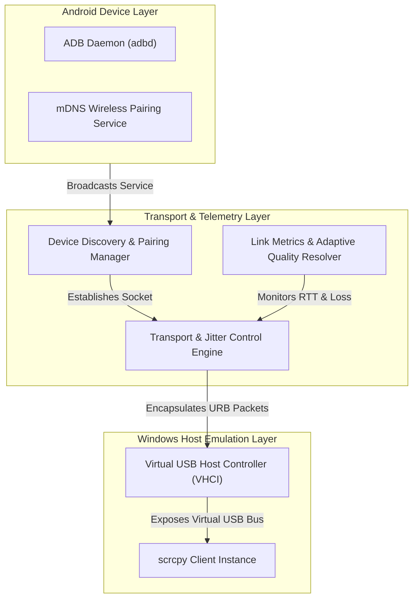
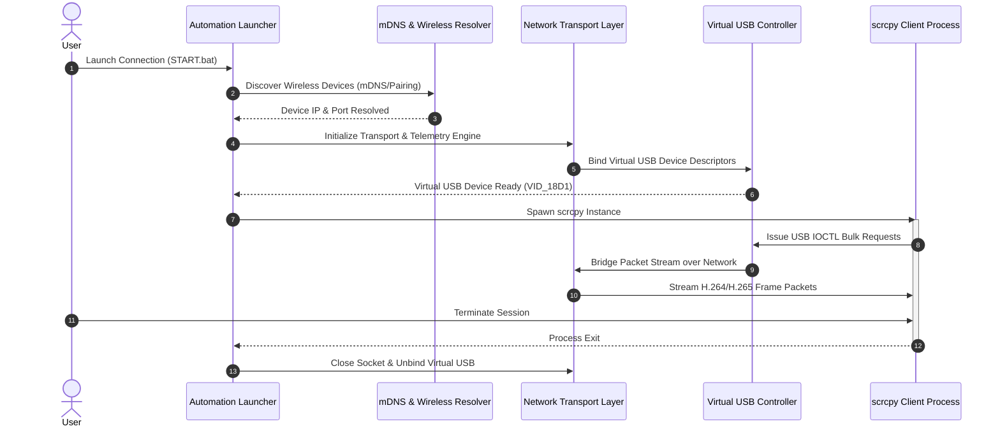

# scrcpy-wifi-module

<p align="left">
  
  
  
</p>

> **Virtual USB-over-IP Cable Bridge for scrcpy**  
> High-performance transport layer that relays ADB & USB packets over Wi-Fi, emulating a physical USB Android connection on Windows Host.

---

## 📌 Overview

**scrcpy-wifi-module** is an automated network transport bridge designed to eliminate physical USB tethering while using [scrcpy](https://github.com/Genymobile/scrcpy). By tunneling Android USB packets over Wi-Fi and managing low-level host device bindings, it allows seamless, low-latency screen mirroring and device control.

---

## ✨ Key Features

- ⚡ **Zero-Configuration Launcher**: Auto-detects local Android devices, handles IP lookup, and starts `scrcpy` in one step.
- 📶 **Wireless ADB Pairing (Android 11+)**: Built-in mDNS discovery for automatic pairing and instant reconnection without requiring initial USB cabling.
- 🎯 **Virtual USB Emulation**: Emulates host-side USB device bindings to maintain reliable communication.
- 📊 **Adaptive Streaming & Telemetry**: Dynamic network analysis (ping, jitter, loss measurement) that auto-adjusts bitrate, resolution, and frame rates for Wi-Fi hotspots or unstable networks.
- 🔄 **State Persistence**: Remembers previously paired devices for background auto-reconnect.
- 🧪 **Simulation Mode**: Integrated test environment with mock ADB daemons for testing without physical hardware.

---

## 🏗️ Principle of Operation

`scrcpy-wifi-module` orchestrates the complete lifecycle of a virtual USB-over-IP connection through three main layers: discovery & telemetry, virtual host driver emulation, and client execution.

### Architecture Overview



### Execution & Control Workflow

When a connection is initiated, the system executes the following operational pipeline:



---

## 🚀 Quick Start

### Prerequisites

- **Host OS**: Windows 10/11 (64-bit)
- **Dependencies**:
  - `Python 3.8+`
  - `CMake 3.15+`
  - `scrcpy` and `adb` available in system `PATH`
  - `Node.js LTS` (optional, only for the CyberDeck Electron window)

---

### Basic Usage

#### Option A: One-Click Auto Run (Recommended)

Run via Windows script:

```cmd
START.bat
```

Window with the phone list opens first; closed it without a choice —
the script continues automatically in the console.
Console-only mode (never opens a window):

```cmd
START_CONSOLE.bat
```

#### Option B: Advanced Command Line Interface

```powershell
# Auto-detect local phone and start scrcpy
python tools/auto_run.py

# Wireless pair via 6-digit Android code
python tools/auto_run.py --pair-code 123456

# Force quality profile (Ideal for 2.4 GHz Wi-Fi / Hotspots)
python tools/auto_run.py --quality low

# Run simulation test environment (No phone connected)
python tools/auto_run.py --mode demo
```

---

## ⬇️ Download & Usage

### 1. Download

Option 1 — via git:

```cmd
git clone <repository-url>
cd scrcpy-wifi-moduel
```

Option 2 — no git: on the repository page click
**Code → Download ZIP** and unpack the archive into any folder.

### 2. What to install

| Program | Why | How to install |
|---|---|---|
| Python 3.10+ | Runs `START.bat` | From [python.org](https://www.python.org/downloads/): during setup keep **Add python.exe to PATH** and **tcl/tk and IDLE** checked (without the second one the fallback window won't work) |
| Node.js LTS | CyberDeck window (Electron UI) | From [nodejs.org](https://nodejs.org/) |
| adb, scrcpy, cmake | Phone connection and screen | Installed **automatically**: `START.bat install` (via winget), or manually: `winget install Google.PlatformTools`, `winget install Genymobile.scrcpy`, `winget install Kitware.CMake` |

For the CyberDeck window, install its dependencies once
(the program offers to do it on first launch, or do it manually):

```cmd
cd ui
npm install
```

### 3. First run (new phone)

1. The phone and the PC must be on the **same Wi-Fi network**.
2. On the phone enable: **Settings → Developer options → Wireless debugging**.
3. Launch with a double-click:
   ```cmd
   START.bat
   ```
4. A **window with the phone list** opens — click yours.
5. If the phone is not paired yet, the window asks for the **6-digit code
   from its screen** (on the phone: "Pair device with pairing code").
   The code is one-time use.
6. After connecting, the scrcpy window with the picture opens automatically.

### 4. Everyday use

```cmd
START.bat
```

The list window appears **on every launch**, even if the program remembers
the last connection: want the same phone — click it, want another one —
click that one. Closed the window without a choice — the program
reconnects to the last known device by itself and continues in the console.

Handy variants:

```cmd
START.bat --scan                  :: force-show ALL devices on the network
START.bat --phone-ip 192.168.0.XX :: connect directly by IP (find it on the phone:
                                     Settings → About phone → Status)
START_CONSOLE.bat                 :: console only, never opens a window
```

### 5. Diagnostics

```cmd
START.bat check
```

Shows what is present/missing: `adb`, `scrcpy`, `cmake`, the C++ compiler,
and the **windows (GUI)** block — `tkinter`, `electron`, `node`, `npm`.

Typical problems:

- **No window, console only** — look for the `Window skipped: ...`
  line in the console, it states the exact reason. Most common: this Python
  has no tkinter (reinstall Python from python.org with `tcl/tk and IDLE`).
- **CyberDeck won't start** — run `cd ui` → `npm install`
  (requires Node.js LTS). Without it the fallback tkinter window is used.
- **Phone not found** — make sure the PC and the phone share one Wi-Fi
  network and "Wireless debugging" is on (Android 11+).
  `START.bat --scan` also helps.

> **About the C++ compiler (MSVC) and the VHCI driver**: only needed for the
> "virtual USB cable" feature. Plain screen mirroring via scrcpy over Wi-Fi
> works **without them** (the program falls back to TCP mode by itself).

### 6. Linux (Ubuntu/Debian)

One-time setup (installs Python, adb, scrcpy, cmake, Node.js, vhci tools):

```bash
bash scripts/setup_linux.sh
```

Then use it exactly like on Windows:

```bash
./START.sh            # window first, like START.bat
./START_CONSOLE.sh    # console only, like START_CONSOLE.bat
./START_UI.sh         # standalone CyberDeck window
./START.sh check      # diagnostics (adb/scrcpy/cmake/compiler/GUI block)
```

Missing pieces install themselves on request (`sudo apt-get install -y ...`
on Debian/Ubuntu, `sudo pacman -S --needed ...` on Arch).
Notes: the C++ `agent_sender` builds with gcc via the same CMake project
(`agent_receiver` is Windows-only — on Linux mirroring goes over scrcpy TCP,
no Test Signing needed since VHCI is the in-kernel `vhci-hcd` module).

---

## 🛠️ Performance Tuning

For minimum latency and high-framerate performance:

1. **5 GHz Band**: Ensure both the PC and Android device are connected to a 5 GHz Wi-Fi network.
2. **Mobile Hotspot**: If using Windows Hotspot, configure the band to 5 GHz and disable *Power Saving* options for the host network adapter.
3. **Quality Profile**: Use `--quality low` or `--quality medium` on congested wireless networks to prevent buffer bloat.

---

## 📂 Project Structure

```text
scrcpy-wifi-module/
├── src/                # Core C/C++ engine, driver interop, and network stack
├── ui/                 # Status GUI, connection dialogs, and monitor widgets
├── tools/              # CLI runner, automation tools, and network utilities
├── scripts/            # Build utilities and helper scripts (setup_windows.ps1, setup_linux.sh, package_release.py)
├── .github/workflows/  # Release CI: builds Windows + Linux archives on version tags
├── tests/              # Unit tests, mock daemons, and simulation suites
├── CMakeLists.txt      # Root CMake configuration
├── START.bat           # Launcher script for Windows (window first)
├── START.sh            # Launcher script for Linux (window first)
├── START_CONSOLE.bat / START_CONSOLE.sh  # Console-only launchers
└── START_UI.bat / START_UI.sh            # Standalone CyberDeck Electron UI
```

---

## 📄 License

Distributed under the MIT License. See `LICENSE` for details.
