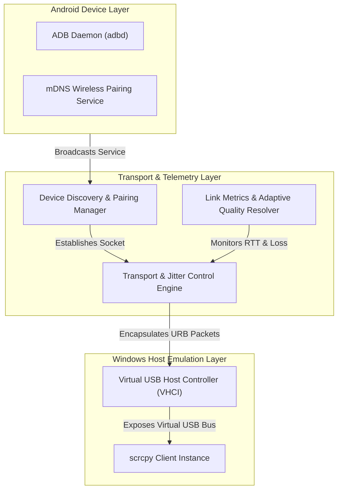
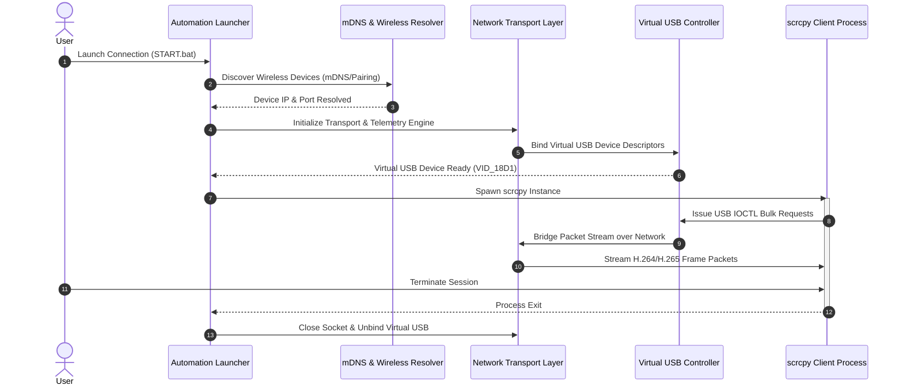

# scrcpy-wifi-module

<p align="left">
  
  
  
</p>

> **Virtual USB-over-IP Cable Bridge for scrcpy**  
> High-performance transport layer that relays ADB & USB packets over Wi-Fi, emulating a physical USB Android connection on Windows Host.

---

## 📌 Overview

**scrcpy-wifi-module** is an automated network transport bridge designed to eliminate physical USB tethering while using [scrcpy](https://github.com/Genymobile/scrcpy). By tunneling Android USB packets over Wi-Fi and managing low-level host device bindings, it allows seamless, low-latency screen mirroring and device control.

---

## ✨ Key Features

- ⚡ **Zero-Configuration Launcher**: Auto-detects local Android devices, handles IP lookup, and starts `scrcpy` in one step.
- 📶 **Wireless ADB Pairing (Android 11+)**: Built-in mDNS discovery for automatic pairing and instant reconnection without requiring initial USB cabling.
- 🎯 **Virtual USB Emulation**: Emulates host-side USB device bindings to maintain reliable communication.
- 📊 **Adaptive Streaming & Telemetry**: Dynamic network analysis (ping, jitter, loss measurement) that auto-adjusts bitrate, resolution, and frame rates for Wi-Fi hotspots or unstable networks.
- 🔄 **State Persistence**: Remembers previously paired devices for background auto-reconnect.
- 🧪 **Simulation Mode**: Integrated test environment with mock ADB daemons for testing without physical hardware.

---

## 🏗️ Principle of Operation

`scrcpy-wifi-module` orchestrates the complete lifecycle of a virtual USB-over-IP connection through three main layers: discovery & telemetry, virtual host driver emulation, and client execution.

### Architecture Overview



### Execution & Control Workflow

When a connection is initiated, the system executes the following operational pipeline:



---

## 🚀 Quick Start

### Prerequisites

- **Host OS**: Windows 10/11 (64-bit)
- **Dependencies**:
  - `Python 3.8+`
  - `CMake 3.15+`
  - `scrcpy` and `adb` available in system `PATH`

---

### Basic Usage

#### Option A: One-Click Auto Run (Recommended)

Run via Windows script:

```cmd
START.bat
```

Window with the phone list opens first; closed it without a choice —
the script continues automatically in the console.
Console-only mode (never opens a window):

```cmd
START_CONSOLE.bat
```

#### Option B: Advanced Command Line Interface

```powershell
# Auto-detect local phone and start scrcpy
python tools/auto_run.py

# Wireless pair via 6-digit Android code
python tools/auto_run.py --pair-code 123456

# Force quality profile (Ideal for 2.4 GHz Wi-Fi / Hotspots)
python tools/auto_run.py --quality low

# Run simulation test environment (No phone connected)
python tools/auto_run.py --mode demo
```

---

## 🛠️ Performance Tuning

For minimum latency and high-framerate performance:

1. **5 GHz Band**: Ensure both the PC and Android device are connected to a 5 GHz Wi-Fi network.
2. **Mobile Hotspot**: If using Windows Hotspot, configure the band to 5 GHz and disable *Power Saving* options for the host network adapter.
3. **Quality Profile**: Use `--quality low` or `--quality medium` on congested wireless networks to prevent buffer bloat.

---

## 📂 Project Structure

```text
scrcpy-wifi-module/
├── src/                # Core C/C++ engine, driver interop, and network stack
├── ui/                 # Status GUI, connection dialogs, and monitor widgets
├── tools/              # CLI runner, automation tools, and network utilities
├── scripts/            # Build utilities and helper scripts
├── tests/              # Unit tests, mock daemons, and simulation suites
├── CMakeLists.txt      # Root CMake configuration
└── START.bat           # Launcher script for Windows
```

---

## 📄 License

Distributed under the MIT License. See `LICENSE` for details.
